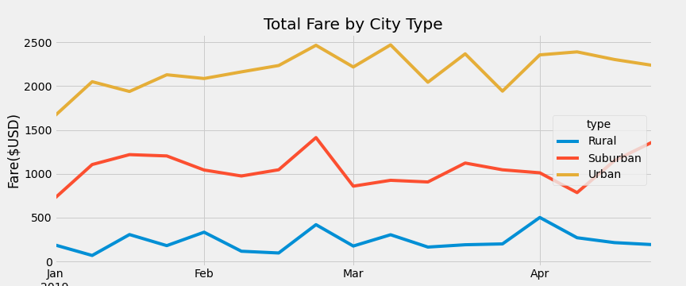

# PyBer_Analysis

## Project Overview

The purpose of this project was to create a summary DataFrame for V. Isualize, the CEO of the PyBer ride-sharing company. This summary gives insight into the performance of the company during the 2019 year, grouped by three city types: Urban, Suburban, and Rural cities. The data in the summary shows us Total Rides, Total Drivers, Total Fares, Average Fare per Ride, and Average Fare per Drive for each city type. Additionally, we created a visual representation of the weekly total fares by city type between January 1, 2019 through April 29, 2019.

## Results

The results of our analysis, as presented in our Pyber Summary below, show the following results for the five metrics analyzed:

- Total Rides: Total rider count is highest in Urban cities and lowest in Rural cities, with Urban cities having 13 times more riders - 1625 to 125 respectively. Suburban cities rank in between with a total of 625 rides.
- Total Drivers: The highest count of total drivers is in Urban cities and the lowest is in Rural cities; Urban cities have nearly 31 times more drivers than Rural cities. Suburban cities rank in between with 490 total drivers.
- Total Fares: The highest sum of total fares is in Urban cities and is lowest in Rural cities. Urban cities generated ~9.2 times more USD in total fares than Rural cities - $39,854.38 and $4,327.93 respectively - and nearly twice as much as Suburban cities, which generated $19,356.33.
- Average Fare per Ride: Average fares per ride were highest in Rural cities at an average $34.62, followed closely by the Suburban cities whose average cost per ride was $30.97. The average cost per ride in Urban cities came out to $24.53.
- Average Fare per Driver: Average fares per driver were highest in Rural cities at $55.49, followed by Suburban cities who had an average fare of $39.50 per driver, and Urban cities had the lowest average fares per driver at roughly $16.57.

Pyber Summary:

Our line chart provides a good visual representation of the total fares by city type for a subsegment of our data - it only looks at data collected from January 1, 2019 through April 29, 2019. In general, it appears as though there are small spikes and drops in the total fares that each city type generates, though each city type has fares that are relatively stable during this 4 month period.

Total Fare by City Type Chart:

## Summary

Based on our results, I would recommend that PyBer consider the following three business recommendations to accomodate for the disparities seen across the three city types:

- Our summary shows that the most profitable city type for PyBer is Urban cities. As previously stated, Urban cities generate roughly 9 times more in total fares than Rural cities and almost twice as much in total fares than Suburban cities. Demand for the service is much higher as can be seen in our summary both from riders and drivers, Pyber had 1,625 total rides and counted 2,405 drivers. Based on this information, I suggest PyBer primarily target Urban cities when consider expanding as volume appears to be the determining factor when measuring profitability and not necessarily average profitability per ride or driver.
- As seen in our summary, Rural towns generate the lowest amount of total rides and have the lowest amount of drivers. When we examine the data presented in the line chart, we can see that even at their highest peak, Rural cities failed to generate as much revenue as the other cities due to sheer lack of volume in demand. Based on this information I recommend that PyBer avoids targeting Rural cities for expansion.
- Although I do not suggest expanding into Rural cities, should PyBer choose to do so anyway, I suggest that the company take initiatives to generate profits by driving up demand among consumers. tPerhaps by setting a cap at how much fares can cost, PyBer would be able to attract more riders. Although setting a cap would effectively lower the average fare that drivers make, our summary has shown that PyBer is still able to attract drivers at an average fare of $16.57 in larger cities where cost of living is presumably higher.
